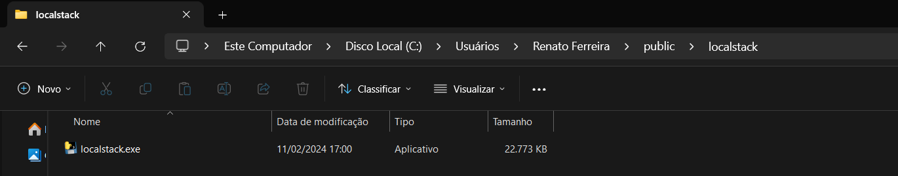
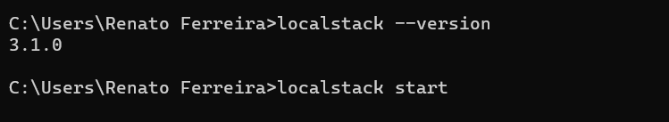
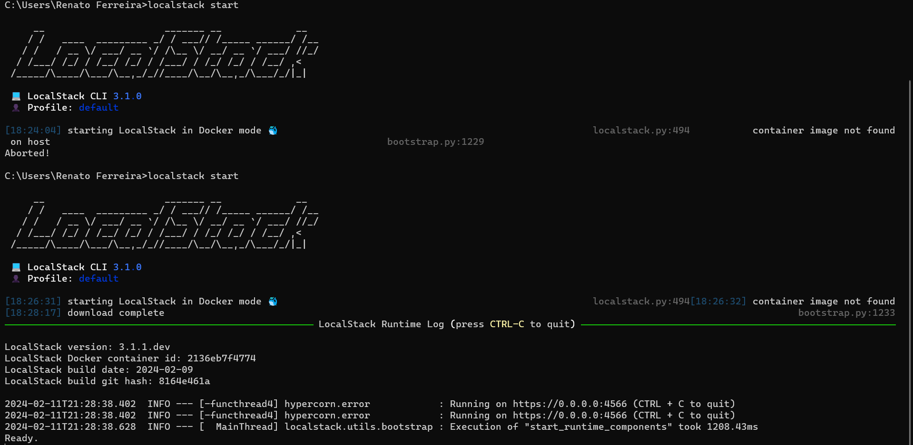
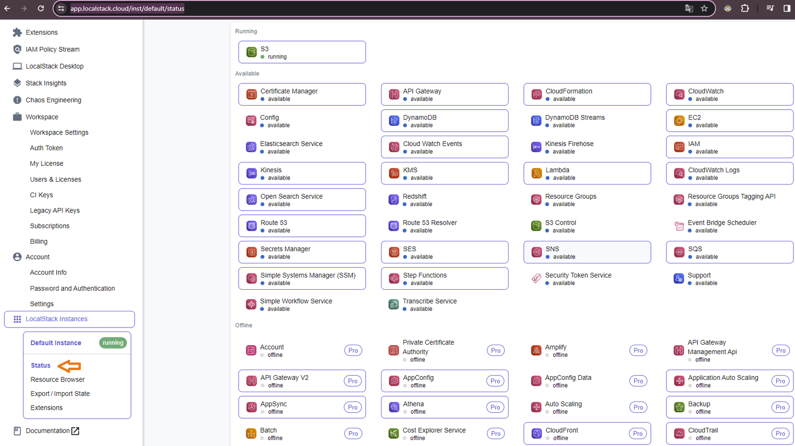
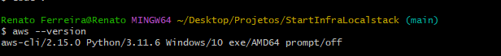
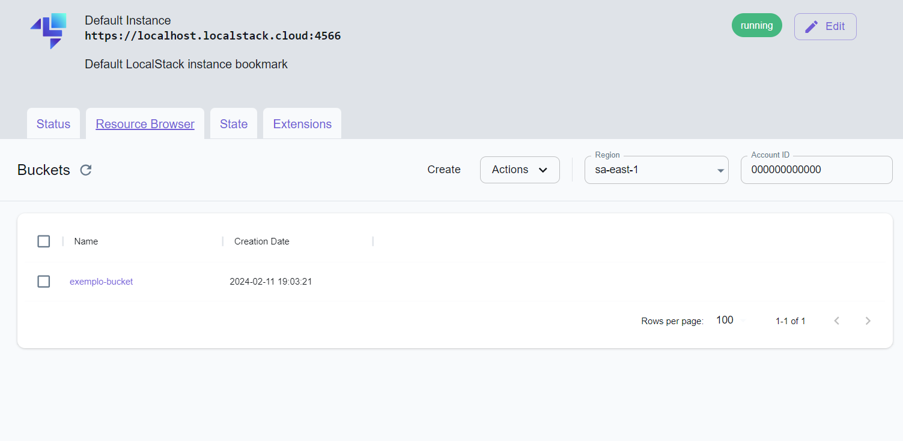
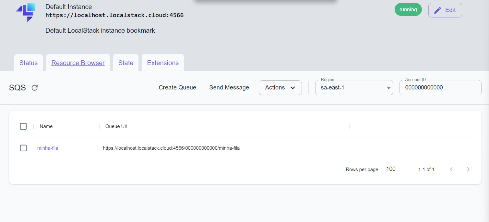

# StartInfraLocalstack
Infra Local Localstack

### Configuração para execultar Local
* Dowloand do Binário site oficial: 
- https://docs.localstack.cloud/getting-started/installation/

* Defina uma pasta na sua maquina exemplo:

* Comando para visualizar versão `localstack --version`
* Inicialize com o comando: localStackStart 

* Edite  as configurações de variaveis de ambiente e adicione o caminho do Binario exemplo: `C:\Users\Renato Ferreira\public\localstack`

A mensagem de Ready indica que o localstack está execultano na sua maquina sem erros.

* Acessar o console localstack 
* Sign in - faça loguin ou com git ou crie uma conta
- https://www.localstack.cloud/ 

* Status e serviços
- https://app.localstack.cloud/inst/default/status

# Instalação e configuração do AWS CLI
- https://aws.amazon.com/pt/cli/

* Verificar versão instalada:

### Comandos Uteis AWS CLI
- aws --endpoint-url=http://localhost:4566 sns list-topics

* Lista topicos
- aws --endpoint-url=http://localhost:4566 sns list-topics

### Criar recursos via terminal aws

- Exemplo criar um bucket no S3
- aws --endpoint-url=http://localhost:4566 s3 mb s3//bucket-no-container

* Lista recursos criados
- aws --endpoint-url=http://localhost:4566 s3 ls
2024-02-08 14:13:10 bucket-no-container

* Criar uma fila SQS
- aws --endpoint-url=http://localhost:4566 sqs create-queue --queue-name minha-fila

### Configurações Docker-Compose
- [Docker-Compose.yml](https://github.com/localstack/localstack/blob/master/docker-compose.yml)

### Para derrubar o serviço Docker Compose:
- docker-compose down

### Para iniciar o serviço Docker Compose novamente:
- docker compose up

### TerraForms Terminal VSCode
- docker-compose up (cria o localstak no docker)
- terraform init
- terraform apply (yes)